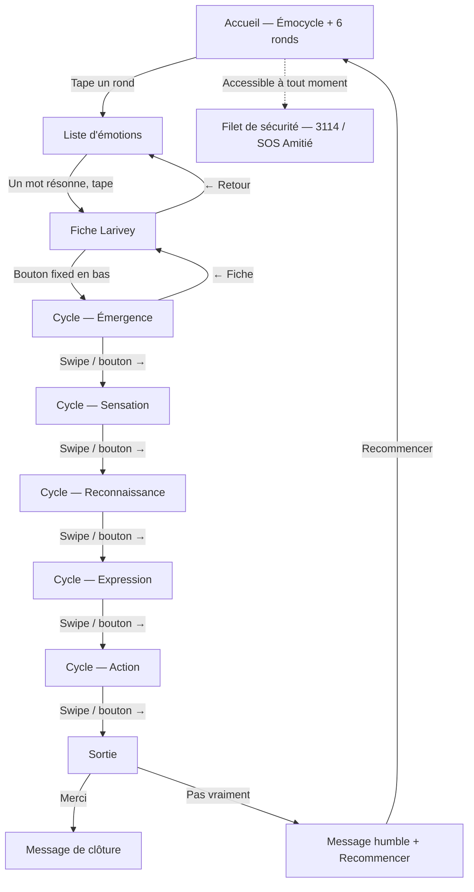

# UX Design Specification — Emotions

**Author:** Beauty
**Date:** 2026-04-04

---

<!-- UX design content will be appended sequentially through collaborative workflow steps -->

## Executive Summary

### Vision du projet

Emotions est une PWA intime et mobile-first qui accompagne l'utilisateur dans l'écoute d'une émotion du moment. Fondée sur les travaux de Jean Garneau et Michelle Larivey, l'app repose sur le cycle de vie émotionnel : quand on laisse une émotion se dérouler — émergence, sensation, reconnaissance, expression, action — son message est reçu et elle se dissout. Et surtout, elle n'occupe plus la place centrale et d'autres émotions peuvent alors exister. L'app crée l'espace pour que ce cycle ait lieu.

Ce n'est pas un mood tracker, pas un journal, pas un chatbot. C'est un moment présent, une émotion à la fois — le Cycle-Présent. L'intelligence est dans la structure du contenu Larivey, pas dans un algorithme.

Le projet est aussi un hommage personnel au livre qui a aidé son créateur.

### Utilisateurs cibles

**Primaire — La personne qui ressent quelque chose**
Tout âge, tout profil. Elle sent une émotion (colère sourde, tristesse diffuse, joie qu'elle veut comprendre) et cherche à l'écouter plutôt qu'à la contrôler. Usage ponctuel, souvent en soirée, seule avec son téléphone. Aucune compétence technique requise.

**Secondaire — La personne qui ne sait pas nommer**
Elle se sent "bizarre" mais n'a pas le mot. L'entrée par la couleur puis par les mots associés l'aide à identifier ce qu'elle ressent.

**Tertiaire — Le professionnel curieux**
Psychologue, coach, enseignant. Découvre l'approche via un partage, s'intéresse au format et aux sources.

### Défis UX clés

1. **L'onboarding invisible** — Guider sans instruire, dans un moment de vulnérabilité. La promesse d'accueil est la seule interface.
2. **La couleur comme interface** — Accessibilité (daltonisme, contrastes WCAG AA) sans perdre la dimension sensorielle.
3. **Le contenu inégal** — Maintenir la qualité de l'expérience quand une fiche Larivey manque de contenu pour une étape du cycle.
4. **Le cycle comme interaction** — 5 étapes séquentielles doivent rester organiques, pas scolaires.
5. **La vulnérabilité** — Chaque mot, chaque transition doit respecter l'état émotionnel de l'utilisateur. Filet de sécurité présent sans être anxiogène.

### Opportunités UX

1. **L'émotion comme designer** — La couleur choisie teinte tout le parcours. Chaque session est visuellement unique.
2. **Le minimalisme radical** — Pas de menu, pas de compte, app presque vide. Positionnement fort face aux dashboards et à la gamification.
3. **Le physique dans le digital** — Tap, scroll, progression tactile. L'interaction engage le corps, cohérent avec le sujet.
4. **Le ton comme différenciateur** — Registre humble et non-directif, rare dans les apps de bien-être.

## Core User Experience

### Expérience fondatrice

L'expérience fondatrice d'Emotions tient en trois gestes : toucher une couleur, trouver le mot, traverser le cycle. Mais le cœur de la valeur n'est dans aucun de ces gestes — il est dans ce qui se passe pendant le cycle.

**Le basculement** — Le visiteur entre préoccupé par une émotion. À un moment du cycle, sans rupture visible, son attention bascule : il n'est plus en train de gérer son émotion, il est en train de découvrir un besoin qu'il ignorait. Et quand ce besoin devient clair, le poids de l'émotion négative s'allège significativement — le message est passé, l'émotion n'a plus besoin de crier. C'est le moment magique de l'app, et tout le reste de l'UX existe pour le rendre possible.

### Stratégie de plateforme

- **PWA mobile-first** — Tactile, intime, utilisable au lit à 23h
- **Hors-ligne pour le contenu statique** — Le cycle ne doit jamais être interrompu par une connexion défaillante
- **Desktop secondaire** — Supporté, mais l'expérience est conçue pour le pouce et le scroll
- **Zéro installation requise** — Un lien suffit. L'installation PWA est proposée, jamais imposée

### Interactions sans effort

- **L'entrée** — Pas de formulaire, pas d'inscription, pas d'explication préalable. Une palette, un tap. L'app donne avant de demander.
- **La progression dans le cycle** — Pas de bouton "suivant" mécanique. La transition entre les étapes doit être fluide, organique, au rythme du visiteur.
- **Le fallback** — Si le contenu Larivey manque pour une étape, le texte générique bienveillant prend le relais sans rupture de ton. Le visiteur ne doit jamais sentir qu'il manque quelque chose.

### Moments critiques de succès

1. **Le mot qui résonne** — Dans la liste d'émotions, un mot s'impose. "Oui, c'est ça." Sans ce moment, le cycle n'a pas de fondation.
2. **Le basculement émotion → besoin** — Le visiteur oublie qu'il était venu pour une émotion. Il comprend ce dont il a besoin. Et ce qui se passe alors est physique : le poids s'allège. C'est la preuve que le cycle fonctionne.
3. **La sortie allégée** — Le visiteur quitte l'app plus léger. Pas guéri, pas résolu — allégé. L'émotion a fait son travail.

### Principes d'expérience

1. **Servir le basculement** — Chaque décision UX est jugée à l'aune de cette question : est-ce que ça aide le visiteur à passer de "mon émotion" à "mon besoin" ?
2. **L'espace plutôt que l'action** — L'app crée un espace, elle n'impose pas un parcours. Le visiteur avance à son rythme.
3. **Le corps d'abord** — Couleur, scroll, tap. L'identification passe par le ressenti avant la cognition.
4. **L'humilité du ton** — L'app accompagne, ne diagnostique pas, ne promet pas. Elle sait qu'elle n'est pas une thérapie.

## Desired Emotional Response

### Objectifs émotionnels primaires

**Déchargement** — Le visiteur arrive avec une charge mentale. La première sensation doit être un soulagement : "ça a l'air simple". Le geste de choisir une couleur est comme piocher une carte — enfantin, sans enjeu, libérateur.

**Reconnaissance** — Pendant le scroll des émotions et la lecture de la fiche, le visiteur se sent compris. Des mots auxquels il n'aurait pas pensé résonnent. Le texte Larivey surprend par sa justesse — c'est déjà une prise de recul.

**Déverrouillage** — Au moment du basculement (émotion → besoin), la perspective change complètement. Une focalisation différente, une prise de recul qui déverrouille. Le poids s'allège.

**Avoir vécu quelque chose** — En partant, le sentiment d'avoir vécu un truc à part. Pas une consultation, pas un exercice — une expérience.

### Cartographie du parcours émotionnel

| Moment | Ressenti visé | Mécanisme UX |
|---|---|---|
| Arrivée | Déchargement, micro-excitation | Écran épuré + effet Kinder (animation 2s de révélation de la palette) |
| Choix couleur | Jeu, curiosité enfantine | Piocher une carte — geste simple, sans enjeu |
| Scroll des mots | Surprise, reconnaissance | Richesse du vocabulaire, mots inattendus qui résonnent |
| Lecture fiche | Être compris, prise de recul | Texte Larivey — surprenant de justesse |
| Cycle — basculement | Déverrouillage, allègement | Changement de perspective, focalisation sur le besoin |
| Sortie [Merci] | Avoir vécu quelque chose | Message de clôture doux |
| Sortie [Pas vraiment] | Accompagnement, pas d'échec | Un mot sympa — l'app reste à côté |
| Retour ultérieur | Familiarité, confiance | Même rituel, nouvelle carte |

### Micro-émotions critiques

| Recherché | Évité |
|---|---|
| Confiance → l'app ne juge pas | Jugement — aucun mot évaluatif |
| Curiosité → "tiens, c'est riche" | Certitude — l'app ne sait pas mieux que le visiteur |
| Surprise douce → mots inattendus, texte juste | Insécurité — données protégées, aucune monétisation visible |
| Légèreté → le geste de piocher | Infantilisation — simple ne veut pas dire simpliste |
| Intimité → un moment à soi | Rémunération de la plateforme — aucun signal commercial |

### Implications pour le design

- **Effet Kinder à l'arrivée** — Une micro-animation (≈2s) qui révèle la palette comme on ouvre une surprise. Le visiteur passe de "je suis chargé" à "je pioche" en un instant.
- **La richesse comme cadeau** — Le vocabulaire émotionnel large n'est pas un menu à parcourir, c'est une découverte. L'UX doit donner le sentiment que chaque mot est une trouvaille possible.
- **Zéro signal commercial** — Pas de cookie banner intrusif, pas de "créez un compte", pas de premium. L'absence de monétisation doit être ressentie, pas juste absente.
- **Le [Pas vraiment] n'est pas un échec** — Le message qui suit doit être un vrai accompagnement, pas une consolation. L'app reste présente sans insister.

### Principes de design émotionnel

1. **Le jeu avant l'effort** — Chaque interaction est un geste simple qui ressemble à un jeu (piocher, scroller, toucher), jamais à un formulaire ou un exercice.
2. **La surprise comme soin** — Les mots inattendus, le texte juste, le basculement de perspective — chaque surprise est un moment de reconnaissance.
3. **L'absence qui rassure** — Pas de jugement, pas de certitude, pas d'argent, pas de données. Ce que l'app ne fait pas est aussi important que ce qu'elle fait.
4. **L'expérience, pas le résultat** — Le visiteur doit partir avec le sentiment d'avoir vécu quelque chose, que ça ait "marché" ou non.

## UX Pattern Analysis & Inspiration

### Sources d'inspiration

**Vice Versa (Inside Out)** — L'association couleur-émotion comme langage universel. Référence pour le principe, pas pour l'exécution : les couleurs de Vice Versa sont trop saturées et enfantines. Emotions emprunte l'idée, la transpose dans un registre adulte et doux.

**Le design éditorial suisse** — Typographie comme architecture. Hiérarchie forte (grand/petit), espace généreux, grille rigoureuse, flat. L'app doit ressembler à un beau livre qu'on feuillette, pas à une interface logicielle.

### Direction visuelle

#### Couleurs

- **Couleurs franches et lumineuses** — HSL saturation ~50%, luminosité ~70%. Douces mais pas pastels, franches mais pas criardes. Adaptées au plein écran.
- **Pas de noir** — Texte en gris doux `#444444` sur fond clair. Texte en blanc (`#FFFFFF`) sur fond coloré suffisamment contrasté (vérification WCAG AA systématique).
- **Blanc tournant** — Fonds clairs légèrement chauds ou froids selon le contexte, jamais un blanc pur froid.

#### Typographie

- **Font : Lora** (Google Fonts) — Serif humaniste, chaleureuse, belle au dessin. Le caractère des lettres est visible, surtout en grand.
- **Le mot de l'émotion : 48px Lora** — Sur la page de détail, le mot est posé en grand, comme un titre de chapitre. C'est l'ancrage visuel de toute la page.
- **Les mots dans la liste : 24px** — Assez gros pour être tactiles, pour que le scroll soit physique.
- **Le corps de texte : 16-18px** — Effet grand/petit avec le titre. Interlignage généreux (1.6-1.8), text-indent à l'ancienne pour les paragraphes.
- **Gris typographique soigné** — Densité visuelle du texte équilibrée, ni trop aéré ni trop dense.

#### Interactions tactiles

- **Boutons, pas de liens** — Tout est tactile. Les boutons utilisent `opacity: 0.5` sur leur fond pour laisser transparaître la couleur d'écran. Cohérence avec l'univers coloré.
- **Défonce (texte blanc)** — Utilisée quand le fond coloré offre un contraste suffisant. Élégante, lisible, immersive.

### Patterns UX à adopter

| Pattern | Source | Application dans Emotions |
|---|---|---|
| Couleur = émotion | Vice Versa | 6 familles, couleur plein écran |
| Hiérarchie grand/petit | Design suisse | Titre 48px + corps 16-18px |
| Flat + espace généreux | Design suisse | Pas d'ombres, pas de relief, du blanc |
| Tactile-first | Mobile natif | Boutons, scroll, tap — pas de hover |
| Font serif humaniste | Design éditorial | Lora — le dessin des lettres se voit |

### Anti-patterns à éviter

| Anti-pattern | Pourquoi |
|---|---|
| Couleurs saturées enfantines | Vice Versa sans la maturité — incohérent avec le ton |
| Noir sur blanc pur | Trop dur, trop froid pour un espace intime |
| Liens textuels cliquables | Pas tactile, pas immersif |
| Ombres portées, reliefs, gradients complexes | Bruit visuel, casse le flat |
| Petite typographie utilitaire | L'app n'est pas un outil, c'est un espace |
| UI surchargée (icônes, badges, menus) | Contradictoire avec le minimalisme radical |

### Stratégie d'inspiration

**Adopter :** Le langage couleur-émotion, la rigueur typographique suisse, le flat, l'espace, le tactile-first.

**Adapter :** Les couleurs de Vice Versa → franches mais lumineuses et douces. Le design suisse → chaleureux (Lora, gris doux, blanc tournant) plutôt que froid et géométrique.

**Éviter :** L'enfantin, le surchargé, le froid, le commercial, le noir pur, les micro-interactions gratuites.

## Design System Foundation

### Choix du design system

**Tailwind CSS** — Approche utility-first sans opinion visuelle imposée. Pas de bibliothèque de composants pré-stylés.

### Justification

- **L'app a peu de composants UI classiques** — Essentiellement du texte, des couleurs plein écran et des boutons. Pas besoin d'une bibliothèque de composants lourde (Material, PrimeNG).
- **La direction visuelle est très spécifique** — Design suisse, Lora, flat, blanc tournant. Un système imposé (Material Design) demanderait plus d'effort à contourner qu'à utiliser.
- **Tailwind = tokens natifs** — Les couleurs par famille émotionnelle, la typo, les espacements, les breakpoints se configurent dans `tailwind.config` et deviennent des utilitaires cohérents dans toute l'app.
- **Développeur solo** — Tailwind accélère sans ajouter d'abstraction à maintenir. Pas de thème à surcharger.

### Approche d'implémentation

- **Configuration Tailwind** comme source de vérité du design : couleurs (6 familles + neutres), typographie (Lora, tailles, interlignage), espacements, breakpoints
- **Composants Angular standalone** avec classes Tailwind — pas de couche d'abstraction CSS supplémentaire
- **Pas de @apply excessif** — Utiliser les utilitaires directement dans les templates, extraire en classes uniquement pour les patterns très répétés
- **Plugin Tailwind Typography** (`@tailwindcss/typography`) pour le rendu du contenu Larivey (prose, text-indent, interlignage)

### Stratégie de customisation

| Token | Configuration |
|---|---|
| Couleurs familles | 6 familles HSL (joie, amour, désir, tristesse, colère, peur) + variantes luminosité |
| Couleur texte | `gray-700` mappé sur `#444444`, blanc pour défonce |
| Blanc tournant | Fond `warm-50` / `cool-50` selon contexte |
| Font | `fontFamily.serif: ['Lora', ...]` |
| Tailles titres | `text-5xl` (48px) émotion, `text-2xl` (24px) liste |
| Corps | `text-base` / `text-lg` (16-18px), `leading-relaxed` (1.6-1.8) |
| Boutons | Fond avec `bg-opacity-50`, coins arrondis, taille tactile min 44px |

## Expérience fondatrice détaillée

### L'expérience en une phrase

"Tu ouvres l'app, tu touches une couleur, tu choisis un mot, et l'app te guide à travers ton émotion. À un moment tu réalises que c'est pas l'émotion le sujet — c'est un besoin que t'avais pas vu."

### Modèle mental de l'utilisateur

Le visiteur n'arrive pas avec un modèle mental d'app. Il arrive avec une émotion. Son attente n'est pas "utiliser un outil" mais "faire quelque chose avec ce que je ressens". Le modèle le plus proche est celui du geste simple : toucher, découvrir, lire, comprendre. C'est intuitif, presque rituel.

**Ce qui n'existe pas aujourd'hui :**
- Les mood trackers demandent d'enregistrer, pas de traverser
- Les apps de méditation demandent du temps et de la discipline
- Les chatbots demandent d'écrire et proposent des réponses
- Rien ne propose de simplement écouter une émotion via un cycle structuré

### Critères de succès de l'expérience

| Critère | Indicateur |
|---|---|
| Le mot résonne | Le visiteur tape sans hésiter |
| Le texte surprend | Le visiteur lit au lieu de scroller |
| Le basculement a lieu | Le visiteur pense à son besoin, pas à son émotion |
| Le poids s'allège | Le visiteur appuie sur [Merci] |
| L'expérience marque | Le visiteur revient ou partage le lien |

### Patterns UX : familier + innovant

**Familier :**
- Le diaporama plein écran — pattern connu (stories, onboarding), pas besoin d'éducation
- Les puces de pagination — repère discret et universel

**Innovant :**
- La couleur comme porte d'entrée émotionnelle (pas décorative)
- Le cycle émotionnel comme structure narrative du diaporama
- L'absence totale de saisie, de compte, de retour — un moment puis on part

### Mécanique de l'expérience

#### 1. Initiation — L'accueil

- Écran-souffle épuré, promesse courte
- La couleur seule pulse, puis le texte de la promesse apparaît en fondu alpha (≈2s)
- La palette de 6 couleurs est présentée
- Le visiteur tape une couleur

#### 2. Identification — Couleur → Mot

- Fond plein écran dans la couleur choisie
- Liste de mots en 24px Lora, scroll vertical
- Le visiteur tape un mot → transition vers la fiche

#### 3. Contenu — La fiche Larivey

- Mot de l'émotion en 48px Lora, effet grand/petit
- Définition, exemples, utilité — corps de texte 16-18px
- Bouton pour entrer dans le cycle : "Votre [émotion] a quelque chose à vous dire"

#### 4. Traversée — Le cycle en diaporama

- **5 écrans plein écran**, transition CSS horizontale (slide gauche-droite)
- **Swipe tactile** sur mobile, **boutons gauche/droite** sur desktop
- **5 puces de pagination** en bas — repère de progression, pas une step bar
- **Nom de l'étape affiché** sur chaque écran — instructif sur le processus émotionnel
- Chaque écran = une étape du cycle :
  1. **Émergence** — "Cette émotion est là. Laissez-la prendre sa place."
  2. **Sensation** — Attention portée au corps
  3. **Reconnaissance** — Le basculement : découverte du besoin (pas de marquage visuel particulier — le visiteur le vit)
  4. **Expression** — Mettre des mots, imaginer
  5. **Action** — Qu'est-ce que je peux faire avec ça ?
- Bifurcation positif/négatif dans le texte, pas dans la navigation
- Fallback bienveillant si le contenu Larivey manque pour une étape

#### 5. Sortie — Allégé

- Message de sortie douce
- [Merci] / [Pas vraiment]
- Filet de sécurité (numéros d'écoute) accessible
- Pas de relance, pas de "créer un compte"

## Visual Design Foundation

### Système de couleurs

#### Palette émotionnelle (6 familles)

| Famille | Teinte HSL | Émotions associées |
|---|---|---|
| Joie / Plaisir | ~50° | plaisir, contentement, joie, émerveillement... |
| Amour / Tendresse | ~330° | amour, fierté, tendresse, attendrissement... |
| Désir / Envie | ~30° | désir, envie, excitation... |
| Tristesse / Manque | ~220° | tristesse, ennui, nostalgie, peine... |
| Colère / Révolte | ~0° | colère, rage, haine, dégoût, impatience... |
| Peur / Anticipation | ~270° | peur, terreur, effroi... |

- **Saturation :** ~50% — franches mais pas criardes
- **Luminosité :** ~70% — lumineuses, adaptées au plein écran
- Les teintes exactes seront affinées dans le code
- Variantes de luminosité par famille pour les fonds, boutons et états

#### Couleurs neutres

| Rôle | Valeur |
|---|---|
| Texte principal | `#444444` (gris doux) |
| Texte en défonce | `#FFFFFF` (blanc, sur fond coloré contrasté) |
| Fond clair | Blanc tournant — légèrement chaud ou froid, jamais blanc pur froid |
| Fond boutons | Couleur famille à `opacity: 0.5` |

### Système typographique

| Élément | Font | Taille | Graisse | Interlignage |
|---|---|---|---|---|
| Mot émotion (détail) | Lora | 48px | Regular ou Bold | 1.2 |
| Mots liste | Lora | 24px | Regular | 1.4 |
| Nom d'étape du cycle | Lora | 24-32px | Bold | 1.3 |
| Corps de texte | Lora | 16-18px | Regular | 1.6-1.8 |
| Promesse d'accueil | Lora | 18-20px | Regular | 1.6 |
| Boutons | Lora | 16-18px | Regular | 1 |

- **Text-indent** à l'ancienne sur les paragraphes de contenu Larivey
- **Gris typographique soigné** — densité visuelle équilibrée
- **Effet grand/petit** — contraste fort entre titre 48px et corps 16-18px sur la page de détail

### Espacement & Layout

#### Base d'espacement

Base **8px**. Multiples utilisés :

| Token | Valeur | Usage |
|---|---|---|
| `xs` | 8px | Espacement interne dense |
| `sm` | 16px | Espacement entre éléments proches |
| `md` | 24px | Marges de section |
| `lg` | 32px | Séparation de blocs |
| `xl` | 48px | Respiration entre sections majeures |
| `2xl` | 64px | Marges plein écran, espace de souffle |

#### Layout

- **Colonne unique centrée** — pas de grille complexe
- **Largeur max :** ~480px mobile (plein écran), ~640px desktop
- **Écrans du cycle :** 100vh × 100vw, contenu centré verticalement et horizontalement
- **Padding latéral :** 24-32px sur mobile

### Accessibilité visuelle

- **Contraste WCAG AA** vérifié sur chaque combinaison couleur de fond / couleur de texte
- **Texte `#444444` sur fond clair** : ratio ≥ 4.5:1 — OK
- **Texte blanc sur fond coloré** : vérifier que la luminosité du fond est ≤ 55% pour garantir le contraste. Si le fond est trop clair (luminosité ~70%), utiliser `#444444` au lieu du blanc
- **Tailles tactiles** : min 44×44px pour tous les éléments interactifs
- **Labels textuels** sur chaque couleur de la palette pour les lecteurs d'écran

## Design Direction — Validée

### Identité

- **Nom :** Émocycle
- **Baseline :** "L'émotion que vous vivez — Émocycle — a un message."
- **Registre :** Design suisse, éditorial, flat. Adulte et doux, jamais enfantin.

### Direction validée

La direction a été explorée via un prototype HTML interactif (`planning-artifacts/ux-design-directions.html`) et validée par itérations successives.

**Accueil :**
- Fond blanc chaud (`--bg-warm`)
- Titre "Émocycle" en très grand (`clamp(72px, 15vw, 140px)`, Lora Bold)
- Baseline coupée en deux sous le titre avec gap de 90px : "L'émotion que vous vivez" — "a un message."
- 6 ronds de couleur alignés horizontalement avec labels pluriels en 12px dessous (Joies, Amours, Désirs, Tristesses, Colères, Peurs)
- Pas de grille, pas de carrés — les ronds rappellent le cycle

**Écrans intérieurs (liste, fiche, cycle, sortie) :**
- Fond sombre de la famille choisie (variante `*-dark`, ~38% luminosité)
- Texte en défonce blanche partout
- Continuité colorée de bout en bout — pas de retour au fond blanc

**Fiche émotion :**
- Titre 48px Lora, texte 17px avec text-indent
- Bouton "Votre [émotion] a quelque chose à vous dire" fixed en bas de page, toujours accessible pendant le scroll

**Cycle :**
- Diaporama horizontal plein écran, 5 puces de pagination
- Nom de l'étape affiché en uppercase
- Textes personnalisés avec le nom de l'émotion ("Le ressentiment est là")
- Modèle de données : champ `gender` (m/f) pour accorder les articles

**Sortie :**
- Même fond coloré sombre que le parcours
- Bouton [Pas vraiment] avec bordure visible pour contraste

### Tokens CSS

```css
/* Neutres */
--text: #444444;
--text-light: #777777;
--text-on-dark: #ffffff;
--bg-warm: #faf8f5;

/* Familles — palette (accueil) */
--color-joie: hsl(45, 70%, 58%);
--color-amour: hsl(335, 55%, 58%);
--color-desir: hsl(20, 65%, 58%);
--color-tristesse: hsl(220, 50%, 55%);
--color-colere: hsl(0, 55%, 55%);
--color-peur: hsl(270, 45%, 55%);

/* Familles — fond sombre (écrans intérieurs) */
--color-joie-dark: hsl(45, 55%, 38%);
--color-amour-dark: hsl(335, 42%, 38%);
--color-desir-dark: hsl(20, 50%, 38%);
--color-tristesse-dark: hsl(220, 42%, 38%);
--color-colere-dark: hsl(0, 45%, 38%);
--color-peur-dark: hsl(270, 38%, 38%);

/* UI */
--radius: 12px;
--transition: 0.3s ease;
--btn-bg: rgba(255, 255, 255, 0.15);
--btn-bg-hover: rgba(255, 255, 255, 0.25);
```

### Prototype de référence

`_bmad-output/planning-artifacts/ux-design-directions.html` — 8 écrans navigables couvrant le parcours MVP complet.

## User Journey Flows

### Parcours MVP — Le cycle qui se déroule (Léa)

**Entrée :** Le visiteur arrive sur l'app, probablement via un lien partagé. Il ressent quelque chose et veut l'écouter.



### Détail de chaque étape

| Étape | Contenu | Interaction | Transition |
|---|---|---|---|
| Accueil | Titre Émocycle, baseline, 6 ronds + labels | Tap sur un rond | Fond passe à la couleur sombre de la famille |
| Liste | Mots en 24px centrés, header famille | Scroll + tap sur un mot | Transition vers la fiche |
| Fiche | Titre 48px, définition, exemples, utilité | Scroll le texte, bouton fixed en bas | Bouton mène au cycle |
| Émergence | "[Le/La] [émotion] est là. Laissez-[le/la] prendre sa place." + guide | Swipe ou bouton → | Slide horizontal |
| Sensation | Attention portée au corps, sensations physiques | Swipe ou bouton → | Slide horizontal |
| Reconnaissance | "Et si [ce/cette] [émotion] était lié·e à un besoin ?" + guide | Swipe ou bouton → | Slide horizontal |
| Expression | Mettre des mots, imaginer ce qu'on pourrait dire | Swipe ou bouton → | Slide horizontal |
| Action | Qu'est-ce que je peux faire avec cette compréhension | Swipe ou bouton → | Slide horizontal |
| Sortie | Message doux + [Merci] / [Pas vraiment] + filet | Tap bouton | Transition douce |

### Embranchements

- **Filet de sécurité** — Numéros d'écoute (3114, SOS Amitié) accessibles à tout moment via un lien discret, pas seulement en fin de parcours
- **Retour** — Bouton ← depuis le cycle vers la fiche, depuis la liste vers l'accueil
- **Recommencer** — Depuis la sortie [Pas vraiment], retour à l'accueil

### Bifurcation positif / négatif

La bifurcation n'est pas dans la navigation (pas de branche séparée). Elle est dans le texte :

- **Émotion négative** (besoin insatisfait) : "Et si cette émotion était liée à un besoin qui vous appelle ?"
- **Émotion positive** (besoin comblé) : "Et si cette émotion vous montrait ce qui compte vraiment pour vous ?"

Le chemin est le même, les mots changent. La classification positif/négatif est dans le modèle de données (champ `valence`).

### Principes de flow

1. **Linéaire et simple** — Un seul chemin principal, pas d'arbre de décision complexe. Le visiteur avance, c'est tout.
2. **Retour possible, jamais imposé** — On peut revenir en arrière mais l'UX encourage la progression.
3. **Le filet partout** — L'app sait qu'elle touche à l'intime. Les numéros d'écoute ne sont pas un afterthought.
4. **Pas de cul-de-sac** — Chaque écran mène quelque part. Même [Pas vraiment] propose de recommencer.

---

## Révisions issues du test utilisateur — 2026-04-11

### Parcours principal révisé

La fiche Larivey est **retirée du flux principal**. Le parcours devient :

```
Accueil → Couleur → Liste → Cycle
```

La fiche reste accessible à tout moment depuis le cycle, via le nom de l'émotion.

### Accueil — Contenu sous la ligne de flottaison

La zone au-dessus de la fold reste inchangée (titre Émocycle, baseline, 6 ronds).

En dessous, deux encarts en colonnes :

| Colonne gauche | Colonne droite |
|---|---|
| Le cycle de vie des émotions | Le dictionnaire des émotions |
| Texte d'intro court sur le principe du cycle | Texte d'intro court sur la richesse du dico |
| Bouton [Découvrir] → page cycle | Bouton [Explorer] → page dictionnaire |

> **Note planning :** Ces 2 encarts sous la fold ne sont dans aucune story active — ils feraient partie d'une story à créer (probablement Epic 2 aussi, ou un Epic séparé pour les pages annexes).

### Modale disclaimer — Première visite avant le cycle

Déclenchée en **mémoire vive** (pas de localStorage) à la première entrée dans un cycle de la session. Se réinitialise au F5.

Contenu :
> *"Afin de tirer le meilleur parti de cette expérience, découvrez les 5 étapes du cycle de vie des émotions."*
> `[Découvrir]` `[Passer cette étape]`

À partir de la deuxième entrée dans un cycle (même session), la modale n'apparaît plus.

### Bouton [?] — Persistant dans le cycle

Présent sur chaque écran du cycle. Mène à la page d'explication du cycle de vie des émotions (même destination que [Découvrir] de la modale et de l'encart accueil).

### Fiche Larivey — Accessible depuis le cycle

Le **nom de l'émotion** affiché dans le cycle est tappable. Il est accompagné d'une micro-icône livre (📖) comme signal visuel.

Tap → ouvre la fiche en **modale presque full-screen** (marge 20px sur tous les côtés).

### Modale fiche — Spécification

- Marge : 20px sur tous les côtés, quelle que soit la page d'origine (cycle ou dictionnaire)
- Contenu : fiche Larivey complète (titre 48px, définition, exemples, utilité)
- Fermeture : croix ou tap en dehors

### Dictionnaire des émotions — Page dédiée

Accessible depuis l'encart accueil. Affiche **toutes les émotions**, y compris celles sans fiche.

**Affichage :**
- Multi-colonnes (2 colonnes mobile, plus sur desktop), mobile-first
- Taille de police : 16px
- Retour à la ligne accepté sur les noms longs
- Émotions **avec fiche** : gras, cliquables → modale fiche (20px margin)
- Émotions **sans fiche** : poids normal, non cliquables

### Tableau de synthèse des décisions

| Sujet | Décision |
|---|---|
| Parcours principal | Couleur → Liste → Cycle (fiche retirée du flux) |
| Fiche dans le cycle | Tap sur nom de l'émotion + micro-icône livre → modale |
| Modale fiche | Presque full-screen, marge 20px, quelle que soit l'origine |
| Explication du cycle | [?] dans le cycle → page dédiée |
| Première visite cycle | Modale disclaimer (mémoire vive, reset au F5) |
| Accueil sous la fold | 2 encarts : cycle de vie + dictionnaire |
| Dictionnaire | Page dédiée, toutes émotions, multi-colonnes 16px |
| Émotions avec fiche | Gras, cliquables → modale fiche |
| Émotions sans fiche | Normal, non cliquables |
